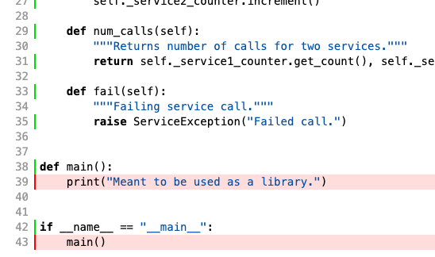

# DemoRepo

This repo is meant to demonstrate best practices with respect to code health and shareability.
It focuses on python code but includes tools for checking on other types of files. Most
of the configurations were copied from the EDD repository.

The repo has two simple python modules, *counter.py* and *service.py*, which are meant only
to illustrate use of the styling and testing approaches and tools.

We would like to keep the styling configs up-to-date so that as many people as possible are
all using the same styles to improve readability of code across projects. Feel free to 
contribute suggestions for modifying these configs.

## Tests

Unit tests for a module are placed in the same directory with the same name plus a _\_test_ suffix.
So unit tests are easy to find and run for any given module.

Integration tests, those which involve use of multiple modules, are placed in their own directory.

We do not provide example end-to-end tests for this repo, but they would also have their own directory
and would run in the context of a non-production service (_eg_ a _staging_ or _dev_ service).

### Test Coverage

Install the test coverage tool:

```pip install coverage```

This tool is called in the _run_all_tests.sh_ script. It will show you a text description of the
coverage if the tests all pass, and it will generate a directory of html that gives a more
detailed description of the coverage. You can access this by running:

```open htmlcov/index.html```

This can be very useful for inspecting uncovered parts of the code. For example, in this repo we 
adopt a style that all python should have an executable main(), even if it is intended to be used
as a library module. We do test this code, which you can see when you inspect the coverage details:




### Testing Notebooks

DemoRepo contains two jupyter notebooks in */notebooks*. This directory also contains a script
to run the notebooks with *runipy*. To run this script, install runipy:

```pip install runipy```

You can then run the script:

```./run_notebook_tests.sh```

Note that these tests only ensure that the notebooks can execute; they do not test correctness of
the notebook code.

For demonstration purposes, the directory contains one notebook that succeeds, *WorkingDemoRepoNotebook.ipynb*,
and one that fails, *FailingDemoRepoNotebook.ipynb*.

## Pre-commit

Setting up pre-commit is fairly straightforward. This repo includes a _.pre-commit-config.yaml_ file
which sets up the hooks for tools that are run before a commit can complete. These tools help
standardize formatting and clean up code (e.g. remove unused imports) before it is submitted.

To install pre-commit in your env, run:

```pip install pre-commit```

You can then install the pre-commit script in git by running:

```pre-commit install```

If you have a _.pre-commit-config.yaml_ file in your rep, you will notice differences in your next commit.
The tools specified in _.pre-commit-config.yaml_ will run and will block the commit if any
errors are found. It may be helpful to run the tools directly when you are trying to fix these errors.

For the python tools _black_ and _flake8_, install the tools with:

```
pip install black
pip install flake8
```

If you have errors in say _myfile.py_, you can fix the formatting errors with:

```black myfile.py```

Don't forget to add the changes to the staged area before you retry your commit.

For _flake8_ errors, you can list them by running _flake8_ directly, but you 
may have to make fixes by hand.

```flake8 myfile.py```

